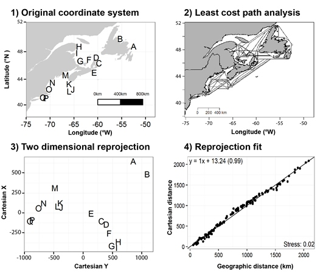

# CartDist
Code to re-project marine least-cost distances into Cartesian coordinates.

[](https://zenodo.org/badge/latestdoi/93073704)




Example workflow 1) assemble coordinates in native geographic coordination, 2) calculate least-cost path accounting for land as barrier, 3) calculate 2 dimensional rescaling using metaMDS, 4) compare distances in 2 dimensional rescaling with least-cost distances. Example locations from [Benestan et al. 2016](http://onlinelibrary.wiley.com/doi/10.1111/mec.13245/abstract). 


***
**Requirement:**
CartDist requires the installation and availability of the following packages

* CartDist requires the installation and availability of the following packages:
* extracting meta-data:
    * [gdistance](https://cran.r-project.org/web/packages/gdistance/gdistance.pdf)
    * [marmap](https://cran.r-project.org/web/packages/marmap/vignettes/marmap.pdf)
    * [ggplot2](http://ggplot2.org/)
    * [vegan](https://cran.r-project.org/web/packages/vegan/vegan.pdf)


***

## Contributions:
*CartDist* was coded by Ryan Stanley <https://github.com/rystanley> and Nick Jeffery <https://github.com/NickJeff13>

* If you don’t understand something, please let me know: 
(ryan.stanley _at_ dfo-mpo.gc.ca) or (nick.jeffery _at_ dfo-mpo.gc.ca)
* Any ideas on how to improve the functionality are very much appreciated. 
* If you spot a typo, feel free to edit and send a pull request.

Pull request how-to: 

  * Click the edit this page on the sidebar.
  * Make the changes using github’s in-page editor and save.
  * Submit a pull request and include a brief description of your changes. (e.g. "_spelling errors_" or "_indexing error_").
  
***

# **Citation** 

A Zenodo DOI is also avaiable for the most recent release of **CartDist**:

[](https://zenodo.org/badge/latestdoi/93073704)


Stanley, R.R.E and N.W. Jeffery 2017. CartDist: Re-projection tool for complex marine systems. DOI 10.5281/zenodo.802875


***
# **Installation**

*CartDist* can be sourced into the workspace by cloning this [Github directory](https://github.com/rystanley/CartDist) or by sourcing directly using the web url.

<a name="installation"/>

```r
library(RCurl) # if you do not have the package rcurl installed please load from CRAN.
library(EBImage) # see installation instructions for the EBImage package.

#links for the 'raw' code
Weblink <- c("https://raw.githubusercontent.com/rystanley/CartDist/master/CartDistFunction.R")

#source the 'raw' code links into the local environment
  script <- getURL(Weblink, ssl.verifypeer = FALSE)
  eval(parse(text = script),envir=.GlobalEnv)
  rm(script)  

```

# **Output**

## Output is a list object containing:

**Parameter** | **Description**  
--------------|-----------------------------------
*Coords* | Geographic and Cartesian coordinates. 
*fit.plot* | Realized vs projected distance comparision. 
*mod*| Realized vs projected distance model. 
*trans*| A transition object (object from the marmap::trans.mat or the transition object supplied by input parameter 'trans'). 
*lc.dist* | Pairwise dissimilarity (km) among locations in the container provided by marmap::lc.dist.
*bathydata* | Bathymetric data calcaulted for region. 

# **Example use**

**Parameter** | **Input**  
--------------|-----------------------------------
*coordinates* | This .csv file requires at least 3 columns - "Code","Lat", and "Long". Make sure your points are not on land prior to analysis. 
*min.depth* | The minimum depth required to calculate least-cost distances for your species of interest. 
*max.depth*| The minimum depth required to calculate least-cost distances for your species of interest. Can be NULL. 
*trans*| A transition object (object from the marmap::trans.mat). Defualt is NA and will be calcauted. If this has been calculated already it can be included as a workspace object.
*gridres* | The resolution used during marmap's bathymetry calculations. Ranges from 1-4, with 1 being the highest resolution. Note that higher resolutions will take a longer time.
*directory* | The directory you want your results and figures deposited in. 

## Re-project example coordinates into cartesian space accounting for land (>0 depth) as a impermeable barrier to dispersal. Note the data used in this example are available [here](https://github.com/rystanley/CartDist/tree/master/exampledata)


```r

coord_cartesian("exampledata/examplecoordinates.csv", min.depth=-5,max.depth=NULL, gridres=2, directory="~/Desktop/") 

```


An example bathymetry map with points produced by this function using the marmap package [Pante and Simon-Bouhet 2013](https://cran.r-project.org/web/packages/marmap/index.html)


Example output. Shows a linear model of geographic versus Cartesian least-cost distances among sample sites. A strong positive relationship indicates that that your coordinates were re-projected correctly.


Final output will show your stress (<0.05 is good) and new Cartesian coordinates added to your coordinates input. 

"metaMDS reprojection stress = 0.0097"

**Code**  |  **Long** |   **Lat**   |   **MDS1**    |    **MDS2**
----------|-----------|-------------|---------------|-------------
BDB | -61.716 | 47.000 | -495.7915 | -142.653254
BRN | -62.000 | 46.102 | -528.7704 | -221.392140
CBI | -66.800 | 44.400 | 484.5275 | -47.646351
CLH | -63.440 | 44.000 | 186.1135 | 144.096598
KJI | -65.000 | 43.300 | 294.2912 | -14.405217
MBO | -61.900 | 46.000 |  -530.9009 | -220.900346
NWH | -70.100 | 42.959 |  671.4362 | -244.326054
PLB | -54.300 | 46.500 | -502.5656 |  585.986324
SGB | -59.500 | 48.350 | -527.2547 |   35.758083
SYH | -60.000 | 46.500 | -347.4827 |   -6.182589
TKT | -74.200 | 39.006 | 1296.3973 |  131.664946
